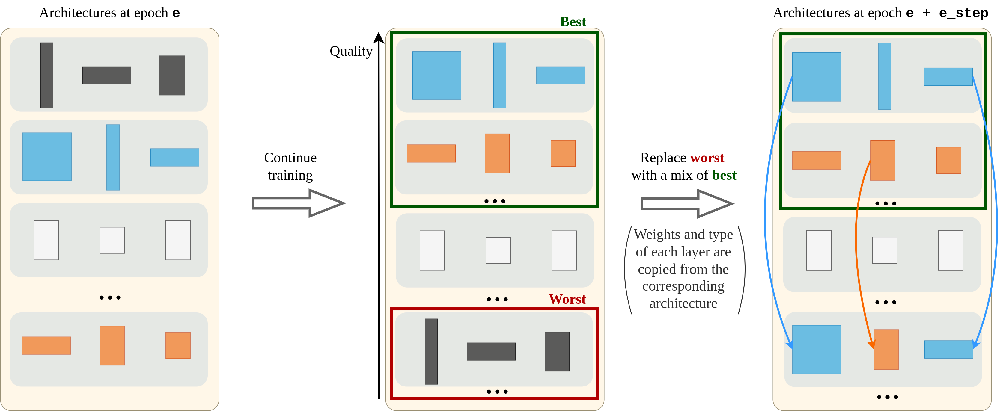
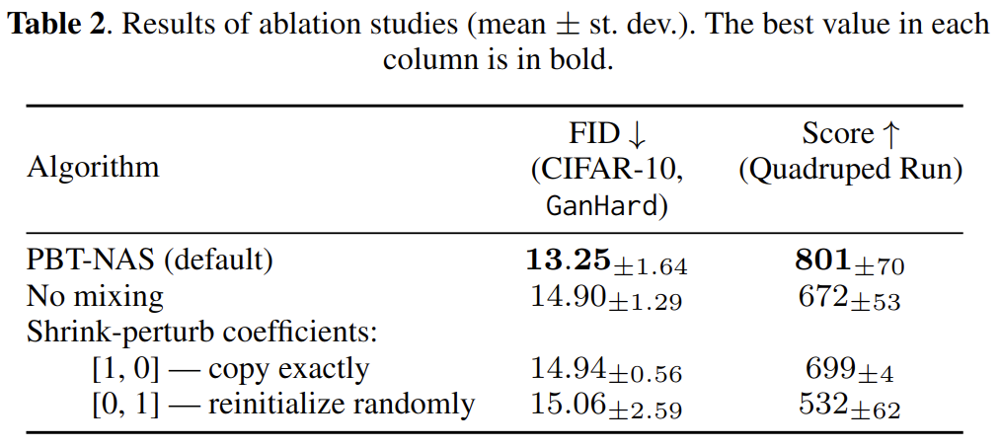
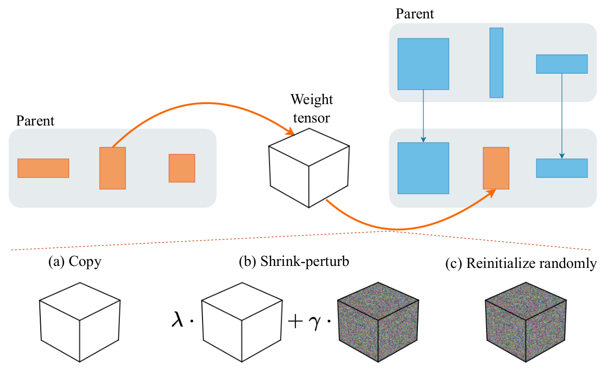

# PBT-NAS

This repo contains the code for our paper "Shrink-Perturb Improves Architecture Mixing during Population Based Training for Neural Architecture Search"

<p align="middle">
    
</p>

## Abstract

In this work, we show that simultaneously training and mixing neural networks is a promising way to conduct Neural Architecture Search (NAS). For hyperparameter optimization, reusing the partially trained weights allows for efficient search, as was previously demonstrated by the Population Based Training (PBT) algorithm.

We propose PBT-NAS, an adaptation of PBT to NAS where architectures are improved during training by replacing poorly-performing networks in a population with the result of mixing well-performing ones and inheriting the weights using the [shrink-perturb](https://proceedings.neurips.cc/paper/2020/hash/288cd2567953f06e460a33951f55daaf-Abstract.html) technique. After PBT-NAS terminates, the created networks can be directly used without retraining. PBT-NAS is highly parallelizable and effective: on challenging tasks (image generation and reinforcement learning) PBT-NAS achieves superior performance compared to baselines (random search and mutation-based PBT).

## Results

See the paper for the results of our GAN experiments (two search spaces * two datasets) & RL experiments (three challenging MuJoCo tasks). 
We would like to highlight our ablation studies showing the benefit of shrink-perturb:

<p align="middle">
     
</p>
<p align="middle">
    
</p>

## Setup
Create & activate conda environment 
```
conda env create --file env_pbtnas.yml
conda activate pbtnas
```
Set environmental variables
```
export OMP_NUM_THREADS=4
export OPENBLAS_NUM_THREADS=4
export VECLIB_MAXIMUM_THREADS=4
export NUMEXPR_NUM_THREADS=4
export MKL_NUM_THREADS=1
export MUJOCO_GL=egl
ulimit -n 500000
```
## Setup for many machines
If more than one machine is used, everything above needs to be repeated per machine. Communication between machines proceeds via ssh/rsync, which requires an agent running in the background
```
eval "$(ssh-agent -s)"
ssh-add /path/to/the/key
```
Additionally, Ray will have to be started per machine.
One machine should be a head node (``--head`` parameter of ray). It also should have a "head_node" resource, which is used in the code when a function has to be run on the head node. Finally, each machine should have a resource per model that will be trained there. In the example below, there are resources for models with ids "0", "1", .., "5".
```
ray start --head --port=6379 --resources='{"head_node": 1000, "0": 1, "1": 1, "2": 1, "3": 1, "4": 1, "5": 1}'
```
After the head node has started, it will report its IP address, and the other nodes can be attached:
```
ray start --address='192.168.0.1:6379' --resources='{"6": 1, "7": 1, "8": 1, "9": 1, "10": 1, "11": 1}'
```
## Running experiments
```
python run.py --config configs/main/c10_pbtnas.yml
```
Configs for all experiments are in the ``configs`` dir. Note that configs need to be modified to refer to your paths. Refer to the comments in the ``c10_pbtnas.yml`` config for explanations.

For BOHB experiments, use ``bohb.py`` instead of ``run.py``

## Figures
Once the experiments have been run, the figures and statistical tests can be reproduced by running scripts in the ``plot`` directory. Note that the ``LOGS_PATH`` variable in ``plotting_functions.py`` needs to be set to your logs path.

The data of all our experiments (including the weights) is available [here](https://surfdrive.surf.nl/files/index.php/s/g8RzR9xfWzm06gZ).

## Code acknowledgments
We used the code of AdversarialNAS (https://github.com/chengaopro/AdversarialNAS), DrQ-v2 (https://github.com/facebookresearch/drqv2), SEARL (https://github.com/automl/SEARL)
